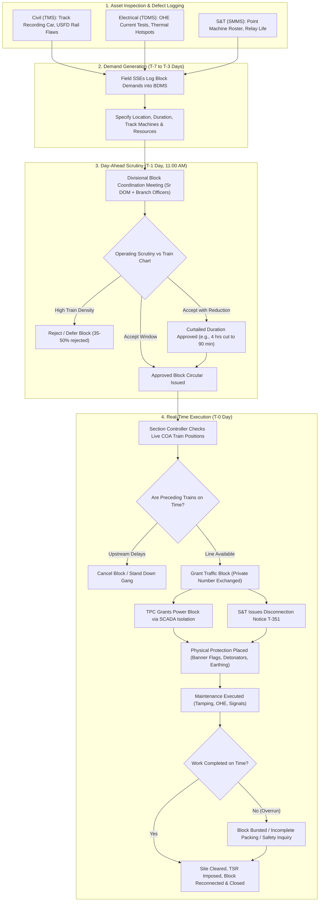

# SIH26027: AI-Powered Automatic Block Planning — Foundations & Domain Analysis
**Project Title:** AI-Powered Automatic Block Planning to Maximize Asset Availability for Train Operations on Indian Railways  
**Problem Statement ID:** SIH26027 | **Ministry:** Ministry of Railways (Government of India)  
**Document Part:** Modules 1 to 5 (Problem Formulation, Railway Domain Hierarchy, Operational Workflow, Existing Systems & Global Benchmarks)

---

## PART 1 — UNDERSTAND THE PROBLEM

### 1.1 The Official Problem Statement in Simple Language
Indian Railways operates over 13,000 passenger trains and 8,000 freight trains daily over a network exceeding 68,000 route kilometers. To keep this massive infrastructure safe, tracks, overhead electric wires (OHE), and signalling systems require continuous inspection, repair, tamping, renewal, and cleaning. To perform maintenance on or near running tracks safely, train traffic must be temporarily halted and overhead high-voltage power disconnected. This reserved time-and-space window is called a **Maintenance Block**.

Today, maintenance blocks are requested independently by three separate engineering departments (Civil Engineering, Electrical TRD, and Signalling & Telecom). The Operating Department (Traffic Controllers) must then manually evaluate these requests against congested train timetables. Because line capacity utilization exceeds 120% to 150% on major trunk routes, controllers routinely refuse, cancel, or drastically curtail these block requests to protect train punctuality. Consequently:
1. Critical maintenance is deferred, creating dangerous safety risks (rail fractures, weld failures, signal failures, OHE snapping).
2. Deferrals force imposition of **Temporary Speed Restrictions (TSRs)**, which permanently bleed network speed and increase overall travel time.
3. When blocks are granted, they are poorly synchronized across departments (e.g., track is blocked for civil work, but electrical teams are not informed to do catenary maintenance simultaneously on the same section).
4. When trains run late, fixed maintenance schedules collapse with no dynamic fallback.

**The core goal of SIH26027 is to build an intelligent, optimization-driven decision-support platform that automatically discovers, bundles, schedules, and dynamically re-plans multi-departmental maintenance blocks to maximize safe track availability while minimizing disruption and delay to train operations.**

---

### 1.2 What "Block Planning" Means in Railway Operations
In railway terminology, a "block" is a formal operational suspension of normal train movement on a designated physical section of track for a specified duration, accompanied by physical and electrical protection. There are three fundamental types of blocks on Indian Railways:
1. **Traffic Block:** Complete suspension of commercial train movements over a designated block section, track, crossover, or station yard line under the supervision of the Section Controller and Station Masters.
2. **Power Block:** De-energization (isolation) and physical earthing of the 25 kV AC Overhead Equipment (OHE) catenary/contact wires over a specific elementary section to permit personnel or machines to work safely within 2 meters of the live equipment.
3. **Disconnection / Reconnection (S&T):** Formal de-linking of signalling, interlocking, points, or track circuits from the active interlocking system using standard Indian Railways forms (S&T (T/351)), preventing signals from being cleared across the affected gear.
4. **Integrated / Combined Corridor Block:** A synchronized window where Traffic Block, Power Block, and S&T Disconnection are granted concurrently over the same physical stretch, allowing all departments to execute work simultaneously.

**Block Planning** is the proactive mathematical and operational coordination required to determine:
- **Which** maintenance activities should be executed?
- **Where** (exact kilometer markers, track line ID, station yard)?
- **When** (start time, end time, duration)?
- **With what resources** (track machines, maintenance gangs, materials, work trains)?
- **How** commercial train traffic should be re-routed, regulated, rescheduled, or temporarily suspended with minimum passenger and freight impact.

---

### 1.3 Why Blocks Are Absolutely Required
Blocks are not optional administrative chores; they are statutory safety imperatives governed by the **Indian Railways General Rules (G&SR)**:
* **Human Life Protection:** Heavy track machines (Ballast Regulators, Dynamic Track Stabilizers, Tie-Tamping Machines) swing multi-ton iron work-heads and occupy adjacent track clearance. Track maintenance gangs working with heavy tools cannot escape high-speed trains (130–160 km/h) without guaranteed physical line closure.
* **Electrical Safety:** Indian Railways traction operates at 25,000 Volts AC. Induction and direct contact are fatal. No personnel or crane booms can approach OHE wires without a certified Power Block and physical discharge rod earthing.
* **Structural Geometry Integrity:** Replacing rails, lifting track for deep screening, tamping ballast, or replacing bridge girders physically severs track continuity. A train entering such a section would immediately derail.
* **Interlocking Integrity:** Replacing point machines or signal cables requires disconnecting fail-safe circuits; during this time, route locking cannot be guaranteed electronically.

---

### 1.4 Why Block Planning is Extremely Difficult
Block planning represents one of the most mathematically complex, high-stakes combinatorial optimization problems in transportation:
1. **Extreme Capacity Saturation:** On the Golden Quadrilateral (GQ) and High-Density Network (HDN) routes connecting Delhi, Mumbai, Kolkata, and Chennai, track utilization regularly exceeds 120% to 160% of chartered capacity. There are virtually no natural "idle gaps."
2. **Asymmetric Train Priorities:** A single block delay affects a complex hierarchy: Premium passenger trains (Vande Bharat, Rajdhani) have strict zero-tolerance punctuality metrics monitored at the Prime Minister's Office (PMO) / Railway Board level, followed by Mail/Express, Suburban locals, Parcel expresses, and loaded freight (coal for thermal plants).
3. **High Spatial and Resource Coupling:** A track machine (e.g., a 09-3X Tamping Express) cannot teleport. It must travel from a siding to the work site, execute work, and clear into a designated refuge loop. Its movement itself consumes train paths.
4. **Stochastic Network Delays:** A freight train delayed 200 km upstream arrives late in the division, colliding with a planned 2-hour maintenance window.
5. **Cross-Departmental Dependencies:** Track lifting requires OHE height adjustment; ballast tamping requires S&T gear uncoupling. If one department fails to mobilize, the entire block is wasted.

---

### 1.5 The Multi-Dimensional Conflict Matrix
Block planning sits at the nexus of fierce, competing departmental objectives:

```
                  +-------------------------------+
                  |       TRAIN OPERATIONS        |
                  | Punctuality, Headway, Revenue |
                  +---------------+---------------+
                                  | (Direct Conflict)
                                  v
+---------------------------------+---------------------------------+
|                    MAINTENANCE REQUIREMENTS                       |
|   Engineering (P-Way)   |   Electrical (TRD)   |   S&T (Signals)  |
| - Rail grinding         | - Catenary renewal   | - Point overhaul |
| - Ballast tamping       | - Cantilever adjust  | - Cable testing  |
| - Rail flaw removal     | - Insulator cleaning | - Axle counters  |
+---------------------------------+---------------------------------+
                                  |
               +------------------+------------------+
               |                                     |
               v                                     v
+-------------------------------+   +-------------------------------+
|     SAFETY & RESTRICTIONS     |   |      RESOURCE BOTTLENECKS     |
| - Absolute/Auto Block rules   |   | - Track Machine availability  |
| - 25 kV AC Power isolation    |   | - Heavy work crews (Gangs)    |
| - Speed restrictions (TSR)    |   | - Ballast / Rail inventory    |
| - Minimum braking distances   |   | - Stabling / Refuge loops     |
+-------------------------------+   +-------------------------------+
```

* **Train Operations vs. Maintenance:** Operations is evaluated on train punctuality (KPI: Loss of Punctuality Minutes). Maintenance is evaluated on asset reliability (KPI: Zero asset failures/fractures). Granting a block intentionally delays trains; denying a block risks catastrophic derailment.
* **Engineering vs. Electrical (OHE):** Track tamping raises the track bed by 10–30 mm. If the track is lifted without coordinating with Electrical TRD, the contact wire height relative to the rail changes, leading to pantograph entanglement.
* **Engineering vs. S&T:** Ballast tamping machines can crush signalling track bond wires and damage axle counter sensors if S&T staff are not present to disconnect and protect them.
* **Manpower & Machine Constraints:** A track maintenance gang cannot work continuously for 14 hours. Track machines require periodic depot maintenance, fuel, and certified operators. Materials (ballast trains/hopper wagons) must be staged at nearby stations without blocking through lines.

---

### 1.6 The Actual Optimization Problem Behind SIH26027
SIH26027 is mathematically classified as an **NP-Hard, Multi-Resource, Multi-Departmental Constrained Spatial-Temporal Project Scheduling Problem with Time Windows over a Dynamic Capacitated Network (RCPSP-TW-DCN)** coupled with **Dynamic Train Dispatching and Rescheduling**.

Specifically, the optimizer must:
1. Select an optimal subset of maintenance demands $J = \{j_1, j_2, \dots, j_n\}$ from a backlog across departments.
2. Assign each job a precise time window $[S_j, E_j]$ on a spatial section $L_j$.
3. Allocate shared, scarce mobile resources (Track machines $M$, specialized labor gangs $G$, material rakes $R$).
4. Synchronize co-located jobs (clubbing civil, electrical, and S&T tasks into a single "Shadow Block").
5. Reschedule, re-platform, regulate, or re-route conflicting train trajectories $T = \{t_1, t_2, \dots, t_m\}$ to absorb the block window while minimizing aggregate weighted delay.

---

### 1.7 What "Maximize Asset Availability" Truly Means
A naive interpretation assumes maximizing asset availability means "minimizing maintenance time so trains can run 24/7." **In railway engineering, this is completely false.**
* Running tracks without adequate maintenance causes rapid asset degradation. Untamped track develops geometry defects (twist, gauge, alignment errors).
* When defects exceed safety limits, engineers impose **Temporary Speed Restrictions (TSRs)** (e.g., slowing trains from 130 km/h to 30 km/h over a 2 km stretch).
* Five TSRs on a single division cause more cumulative operational delay and loss of line capacity than a single planned 2-hour maintenance block!
* Furthermore, deferred maintenance leads to **in-service failures** (rail fractures, OHE breakdowns), which shut down the line unscheduled for 4 to 8 hours under emergency conditions.

**True Asset Availability ($A_{\text{net}}$):**
$$A_{\text{net}} = \frac{\text{Operational Hours at Full Sectional Speed} - \text{Planned Block Hours} - \text{TSR Penalty Hours} - \text{Emergency Breakdown Hours}}{\text{Total Calendar Hours}}$$

Maximizing asset availability means:
1. Performing preventive maintenance at the exact right degradation threshold.
2. Eliminating speed restrictions quickly.
3. Conducting multi-departmental work in dense, synchronized bursts (shadow blocks) so track downtime is shared rather than multiplied.

---

### 1.8 What "Automatic Block Planning" Should and Should NOT Mean
To build a credible solution for Indian Railways, the boundary of automation must be crystal clear:

| Dimension | What Automatic Block Planning SHOULD Mean | What It Must NEVER Mean (Strict Safety Boundary) |
| :--- | :--- | :--- |
| **Candidate Discovery** | Automatically scanning 24-hour timetables, detecting low-density gaps, and proposing optimal block windows. | Autonomous granting of blocks without human controller review. |
| **Cross-Department Clubbing** | Proactively identifying overlapping demands from TMS, TDMS, and SMMS and bundling them into unified corridor blocks. | Bypassing statutory S&T disconnection notices or TRD power isolation certificates. |
| **Conflict & Delay Prediction** | Running microscopic simulation to predict exactly which trains will be delayed and by how many minutes for any candidate block. | Overriding railway safety interlocking systems (Route Relay / Electronic Interlocking). |
| **Dynamic Replanning** | Ingesting live GPS delay feeds and instantly computing revised block options when trains run ahead or behind schedule. | Sending automated movement authorities or signal clearances directly to trains. |
| **Role of the System** | **An Intelligent Decision-Support & Optimization Co-Pilot** for the Divisional Operating Manager (Sr. DOM) and Section Controllers. | An unverified black-box autonomous controller. |

---

### 1.9 Operational Bottlenecks Addressed by SIH26027
1. **Departmental Siloing:** Engineering, TRD, and S&T demand blocks on different days on the same section, causing the same track to be closed three times instead of once.
2. **Manual Train Graph Inspection:** Section controllers visually inspect paper or 2D screen time-distance charts (train graphs) to estimate whether a block fits, often erring on the side of refusal out of fear of punctuality loss.
3. **Block Curtailment & Abandonment:** A 3-hour block demand is granted for only 75 minutes. The heavy machine cannot complete its setup, work, and packing cycle in 75 minutes; the block is abandoned or completed defectively, requiring another block tomorrow.
4. **Lack of Dynamic Replanning:** When an incoming train is delayed by 40 minutes, the planned block window is canceled entirely rather than shifted dynamically.
5. **No Quantified Trade-Off Scorecards:** Controllers have no objective mathematical tool showing that granting a 2-hour block today will prevent 180 minutes of cumulative TSR delays over the coming week.

---

## PART 2 — INDIAN RAILWAYS DOMAIN & ORGANIZATIONAL HIERARCHY

### 2.1 Railway Network Operational Hierarchy
The execution of train operations and maintenance follows a strict, disciplined military-style command hierarchy:

```
1. Railway Board (New Delhi)
   └── Apex policy, national rolling corridor block policies, budget, high-level KPIs
2. Zonal Railway (17 Zones, e.g., Northern Railway, Central Railway, Western Railway)
   └── Headed by General Manager (GM); inter-divisional coordination, rolling stock allocation
3. Division (68+ Divisions, e.g., Prayagraj, Mumbai CSMT, Vadodara, Sealdah)
   └── Headed by Divisional Railway Manager (DRM); PRIMARY OPERATIONAL UNIT FOR BLOCK PLANNING
4. Section (Continuous track corridor, 80–200 km, e.g., Ghaziabad to Aligarh)
   └── Controlled 24/7 by Section Controller (Control Office) and Assistant Divisional Engineers
5. Station / Yard (Controlled by Station Master / Yard Master)
   └── Physical signals, points, platforms, loop lines, siding take-offs, interlocking towers
6. Block Section (Track between Advanced Starter signal of Station A to Home signal of Station B)
   └── Governed by Absolute Block or Automatic Block signalling; minimum atom of spatial track isolation
7. Track Infrastructure (Individual lines within section)
   └── Up Main, Down Main, 3rd Line, 4th Line, Common Loops, Crossovers
8. Physical Assets (Components requiring maintenance)
   └── Rails, Welds, Sleepers, Ballast, Point Machines, OHE Cantilevers, Insulators, Axle Counters
9. Trains (Commercial movements occupying tracks)
   └── Premium Passenger, Mail/Express, Suburban, Freight Rakes (BOXN, BCNHL, Container)
10. Maintenance Activities (The physical work performed)
    └── BCM (Ballast Cleaning), Tamping, Rail Grinding, Catenary Adjustment, Cable Testing
11. Blocks (The formal operational grant)
    └── Traffic Block + Power Block + S&T Disconnection
```

---

### 2.2 Departmental Responsibilities & Interests

#### 1. Operating (Traffic) Department
* **Key Officers:** Chief Transportation Planning Manager (CTPM at Zone), Senior Divisional Operations Manager (Sr. DOM at Division), Chief Controller, Section Controllers.
* **Responsibilities:** Train dispatching, line capacity management, punctuality monitoring, train path allocation.
* **Core Mindset:** Protect train punctuality at all costs. Blocks are viewed as capacity losses and operational risks.

#### 2. Civil Engineering Department (Permanent Way & Works)
* **Key Officers:** Principal Chief Engineer (PCE at Zone), Senior Divisional Engineer (Sr. DEN / Co-ord at Division), Divisional Engineer (DEN), Assistant Divisional Engineer (ADEN), Senior Section Engineer (SSE / P-Way, Bridges, Works).
* **Responsibilities:** Structural health of track bed, rails, welds, sleepers, ballast, bridges, culverts, level crossings.
* **Core Mindset:** Track geometry degrades with every gross ton of traffic; without blocks, track will fail, leading to derailments.

#### 3. Track Machine Organization (Specialized wing of Civil Engineering)
* **Key Officers:** Chief Engineer / Track Machines (CE/TM at Zone), Dy. CE/TM, SSE / Track Machines.
* **Responsibilities:** Operation, deployment, maintenance, and logistics of heavy specialized on-track machines (CSM, 09-3X Tampers, BCM, SBCM, DGS, RGM, T-28 point renewal machines).
* **Core Mindset:** High-value capital assets (₹15–40 Crore per machine) must achieve target monthly kilometer outputs; cannot afford idle time or shortened blocks.

#### 4. Electrical Department (Traction Distribution - TRD)
* **Key Officers:** Principal Chief Electrical Engineer (PCEE at Zone), Senior Divisional Electrical Engineer / TRD (Sr. DEE/TRD), ADEE/TRD, SSE / OHE, SSE / Power Supply Installations (PSI).
* **Responsibilities:** 25 kV AC catenary and contact wires, masts, portals, droppers, section insulators, feeding posts, traction substations.
* **Core Mindset:** High-speed pantograph contact requires millimeter-accurate wire tension, height, and stagger; power blocks are non-negotiable for human survival during maintenance.

#### 5. Signal & Telecommunications Department (S&T)
* **Key Officers:** Principal Chief Signal & Telecom Engineer (PCSTE at Zone), Senior Divisional Signal & Telecom Engineer (Sr. DSTE), ADSTE, SSE / Signal, SSE / Telecom.
* **Responsibilities:** Electronic Interlocking (EI), Route Relay Interlocking (RRI), Point machines, color light signals, track circuits, axle counters, Kavach (ATP) equipment, optical fiber networks.
* **Core Mindset:** Any maintenance on points or track circuits requires formal disconnection; equipment must fail strictly to the safe state (Red).

#### 6. Safety Department
* **Key Officers:** Principal Chief Safety Officer (PCSO at Zone), Senior Divisional Safety Officer (Sr. DSO at Division).
* **Responsibilities:** Enforcement of Indian Railways General & Subsidiary Rules (G&SR), accident prevention, safety audits, reviewing block protection measures.

#### 7. Control Office (The Divisional Nerve Center)
* **Personnel:** Chief Controller (DOM/Co-ord), Section Controllers (operating specific railway sections), Power Controller (TRD), TLC (Traction Loco Controller), TPC (Traction Power Controller), Carriage & Wagon Controller.
* **Function:** 24/7 real-time monitoring and coordination of train movements, granting of real-time blocks, handling line clear and emergency diversions.

---

### 2.3 Direct vs. Indirect Stakeholders

| Stakeholder Group | Direct Participants in Block Planning & Execution | Indirectly Affected Stakeholders |
| :--- | :--- | :--- |
| **Planning Phase (26-Week to Day-Ahead)** | - Sr. DOM (Traffic)<br>- Sr. DEN / Co-ord (Engineering)<br>- Sr. DEE / TRD (Electrical)<br>- Sr. DSTE (Signalling)<br>- Dy. CE / Track Machines<br>- Divisional Block Coordinator | - Freight Customers (Coal/Cement/Container)<br>- CRIS (Software systems)<br>- Rolling Stock Maintenance Depots<br>- Commercial / Ticket Booking Offices |
| **Execution Phase (Day of Operation)** | - Section Controller (Operating)<br>- Traction Power Controller (TPC)<br>- Station Masters (at boundary stations)<br>- SSE (P-Way) on-site supervisor<br>- SSE (OHE) on-site supervisor<br>- SSE (Signal) on-site supervisor<br>- Track Machine Operators / Drivers | - Train Crew (Loco Pilots & Guards)<br>- Passengers on traveling trains<br>- Station Porters, Catering Vendors<br>- Industrial Plants awaiting rakes |

---

## PART 3 — CURRENT BLOCK-PLANNING WORKFLOW ON INDIAN RAILWAYS

### 3.1 Step-by-Step Current Workflow
Through field operating practice across Indian Railways divisions, the current block planning and execution cycle operates across four distinct time horizons:

```
[Horizon 1: 26-Week to 4-Week] --> Rolling Block Programme (Macro Corridors)
[Horizon 2: Week-Ahead / T-7]   --> BDMS Digital Demand Submission
[Horizon 3: Day-Ahead / T-1]    --> 11:00 AM Divisional Block Coordination Meeting
[Horizon 4: Real-Time / T-0]    --> Control Office Execution & Private Number Exchange
```

#### Step 1: Identification of Maintenance Requirement
- **Engineering:** Track Recording Cars (TRC), Oscillation Monitoring Systems (OMS), Ultrasonic Flaw Detection (USFD) of rails/welds, and foot-plate inspections detect track defects, entering data into the Track Management System (TMS).
- **TRD:** Current collection tests, infrared thermography of hot spots, foot patrols, and tower wagon runs log contact wire wear into the Traction Distribution Management System (TDMS).
- **S&T:** Routine gear testing rosters, point machine motor current signatures, and signal failure trends log maintenance needs into the Signalling Maintenance Management System (SMMS).

#### Step 2: Work Request & Block Demand Generation (T-7 to T-3 Days)
- The field supervisor (Junior Engineer or Senior Section Engineer - SSE) logs a formal block demand in the **Block & Disconnection Management System (BDMS)**.
- **Data included:** Date, Station from-to, Line (Up/Down/Single), Kilometer from-to, Type of Block (Traffic, Power, Combined, Disconnection), Nature of work, Duration requested (e.g., 3 hours 30 mins), Machines required (e.g., CSM No. 912), Materials required (Ballast hopper train), Speed restriction to be imposed after work (e.g., 30 km/h TSR).

#### Step 3: Departmental Vetting (T-2 Days)
- Demands are vetted by sub-divisional officers (ADEN, ADEE/TRD, ADSTE).
- Conflicting internal departmental demands are sorted, and a prioritized departmental list is finalized.

#### Step 4: Day-Ahead Divisional Block Meeting (T-1 Day, 11:00 AM)
- Chaired by **Sr. DOM** or **DOM (General)** with **Sr. DEN**, **Sr. DEE/TRD**, **Sr. DSTE**, and **Dy. CE/TM**.
- The Operating Department reviews demands against the working timetable and expected freight traffic.
- **The Friction Point:** Operating typically approves only 50% to 65% of requested blocks. Others are refused due to passenger train congestion or curtailed from 4 hours to 90 minutes.
- Inter-departmental clubbing is negotiated verbally or on paper notes.
- The approved list is finalized as the **Daily Block Circular / Program** signed by DOM and sent to the Central Control Office.

#### Step 5: Day of Operation / Pre-Block Coordination (T-0, 2 Hours Prior)
- On-site SSEs and machine operators assemble manpower, machines, materials, and flagmen at the staging siding.
- SSE contacts the Station Master and Section Controller over dedicated railway control telephone / BDMS terminal to confirm the block window.

#### Step 6: Granting the Block (Operational Handshake)
- Section Controller monitors real-time train positions on the **Control Office Application (COA)**.
- If preceding trains are cleared, the Section Controller issues a formal message granting the block.
- **Power Block Handshake:** Traction Power Controller (TPC) operates SCADA to open circuit breakers, de-energizing the OHE. TPC issues a formal **Power Block Permit Number** to the field SSE (OHE). SSE applies physical discharge earthing rods to the catenary.
- **Traffic Block Handshake:** Station Masters at both ends of the block section set signals to "Danger", apply collar rings / electronic software locks to signal levers/VDU controls, and exchange a unique **Private Number (PN)** with the Section Controller and on-site SSE.
- **S&T Disconnection:** Form S&T (T/351) is formally signed and exchanged with the Station Master.

#### Step 7: Execution and Physical Protection
- Field staff deploy physical protection according to G&SR rules:
  - Red banner flags placed at 600 meters from the work site.
  - Three detonators (fog signals) placed 10 meters apart at 1,200 meters from the work site on both sides.
  - Track machines enter the section under pilot protection. Work commences.

#### Step 8: Block Completion / Cancellation & Track Handover
- Machine work ceases 20 minutes before expiry. Track is packed; track clearance and gauge are verified.
- SSE clears tools, men, and detonators.
- If track settling is incomplete, SSE issues a **Caution Order** imposing a Temporary Speed Restriction (TSR) (e.g., 45 km/h for the first 24 hours).
- SSE cancels the block with the Station Master and Controller by exchanging another Private Number.
- Power block is canceled; earthing rods removed; OHE re-energized via SCADA.
- Normal train traffic resumes under caution.

---

### 3.2 Current Realities: Overruns, Delays, and Emergencies
* **What happens if maintenance takes longer (Overrun)?** SSE informs the Section Controller 30 minutes prior. If refused, the team must perform emergency hasty packing, leave the track under severe TSR (e.g., 20 km/h), or overstay the block ("bursting the block"). Bursting a block causes massive cascading passenger train delays and triggers a formal joint inquiry against the engineering supervisor.
* **What happens if a train is delayed upstream?** The Section Controller unilaterally cancels the planned maintenance block or delays its grant by 2 hours. Because maintenance gangs and track machines have limited shift hours, the block is frequently lost for the entire day.
* **What happens during an emergency failure (e.g., Rail Fracture)?** Normal rules are suspended. An emergency block is granted immediately under G&SR 15.09. All train movements are halted until emergency clamping or fishplating is completed.

---

### 3.3 Rule-Based vs. Human-Judgment Decisions

| Decision Step | Nature of Decision | How It Is Done Today | Automation Potential |
| :--- | :--- | :--- | :--- |
| **Conflict Identification** | Purely Rule-Based & Geometric | Manual inspection of train graphs | **100% Automatable** (Algorithmic spatial-temporal collision detection) |
| **Shadow Block Clubbing** | Rule-Based (Proximity & Isolation) | Ad-hoc negotiation in morning meeting | **100% Automatable** (Combinatorial co-location grouping) |
| **Machine Transit Routing** | Constrained Pathfinding | Manual station master negotiation | **90% Automatable** (Time-expanded graph shortest path) |
| **Delay Impact Assessment** | Complex Non-Linear Dynamics | Human gut feeling / rough heuristics | **95% Automatable** (Microscopic train simulation & ML) |
| **Punctuality vs. Asset Risk Trade-off** | Multi-Criteria Value Judgment | Departmental tug-of-war (Traffic wins) | **80% Automatable as Decision Support** (Pareto-optimal scoring) |
| **Statutory Block Authorization** | Safety & Operational Liability | Exchanged Private Numbers by Controller | **0% Automatable (Must remain Human-in-the-Loop)** |

---

### 3.4 Current-State Workflow Diagram



---

## PART 4 — EXISTING INDIAN RAILWAY & INDUSTRY SYSTEMS

To guarantee technical honesty and avoid claiming false novelty, we must rigorously analyze the software systems currently built and deployed by the **Centre for Railway Information Systems (CRIS)** and Indian Railways:

```
+-----------------------------------------------------------------------------------+
|                        EXISTING CRIS & IR IT LANDSCAPE                            |
+--------------------------+------------------------------+-------------------------+
| ASSET SYSTEMS (Siloed)   | OPERATIONAL CONTROL SYSTEMS  | WORKFLOW & TIMETABLING  |
| - TMS (Track P-Way)      | - COA (Train Control Office) | - BDMS (Block Demands)  |
| - TDMS / OHE-AMS (Elect) | - FOIS (Freight Management)  | - SATMS (Track Machine) |
| - SMMS (Signalling S&T)  | - ICMS (Coaching/Passenger)  | - RBS / NTES (Public)   |
+--------------------------+------------------------------+-------------------------+
```

### 4.1 Detailed Analysis of Existing Systems

#### 1. BDMS (Block & Disconnection Management System)
* **What it is:** A web-based transactional workflow portal developed by CRIS (piloted on Central Railway, approved for pan-India rollout).
* **Who uses it:** Field SSEs (Engineering, TRD, S&T), Section Controllers, Station Masters, Divisional Officers (DOM, DEN, DEE, DSTE).
* **What problem it solves:** Replaces physical paper memos and register books for submitting block demands and issuing disconnection notices (Form S&T T/351). Digitizes the approval signatures.
* **Does it perform block planning?** **NO.** BDMS is purely a transactional logging and messaging workflow tool. It has **no optimization solver**, no automated train collision checking, no multi-objective scheduler, and no algorithmic recommendation engine. Humans still manually choose the time windows.
* **Limitations/Gaps:** Does not know if a proposed window conflicts with freight flow; cannot calculate optimal shadow blocks; cannot dynamically replan when trains are late.

#### 2. COA (Control Office Application)
* **What it is:** The mission-critical real-time system used by Section Controllers across all 68+ divisions to monitor and record train movements.
* **Who uses it:** Section Controllers, Chief Controllers, Dy. Controllers.
* **What problem it solves:** Digitizes the historical paper "train chart" (Time vs. Distance graph), tracking train arrivals, departures, crossings, precedences, and line clears.
* **Does it perform block planning?** **NO.** COA is an operational execution and recording system. Controllers manually enter a block when they grant it, which colors a portion of the train graph gray or red. It does not proactively solve or schedule blocks ahead of time.
* **Limitations/Gaps:** Does not perform predictive delay propagation modeling for candidate blocks; reactive rather than proactive.

#### 3. TMS (Track Management System)
* **What it is:** Web-enabled GIS-based asset management system for the Civil Engineering department.
* **Who uses it:** PCE, Sr. DENs, ADENs, SSEs (P-Way), RDSO.
* **What problem it solves:** Tracks rail weld histories, USFD testing defects, track geometry index (TGI), track renewal proposals, and inspection logs.
* **Does it perform block planning?** **NO.** TMS identifies *what* needs repair based on degradation data, but cannot schedule *when* or *how* to execute the repair in coordination with train operations.

#### 4. TDMS / OHE-AMS (Traction Distribution Asset Management System)
* **What it is:** Database tracking electrical overhead equipment assets, catenary/contact wire wear, mast locations, insulators, and power supply installations.
* **Who uses it:** Electrical TRD officers and supervisors.
* **Does it perform block planning?** **NO.** Manages electrical asset inventory and inspection histories only.

#### 5. SMMS (Signalling Maintenance Management System)
* **What it is:** Digital register tracking signal failures, relay life cycles, point machine motor maintenance, and battery health.
* **Who uses it:** S&T department supervisors and officers.
* **Does it perform block planning?** **NO.** Records signal defects and maintenance compliance rosters only.

#### 6. SATMS (Satellite Track Machine Management System)
* **What it is:** GPS-tracking and operational logging system for heavy track maintenance machines.
* **Who uses it:** Track Machine Organization (Dy. CE/TM).
* **What problem it solves:** Tracks machine physical GPS locations, engine hours, and daily output (tamping kilometers, ballast cleaned cubic meters).
* **Does it perform block planning?** **NO.** Monitors machine fleet location; does not optimize cross-departmental block integration with commercial train paths.

#### 7. FOIS (Freight Operations Information System) & ICMS (Coaching System)
* **What they do:** FOIS manages rake allocations, consignment bookings, and freight pipeline tracking. ICMS manages passenger rake links, coach maintenance, and punctuality logs.
* **Do they plan blocks?** **NO.** They are commercial and rolling-stock management databases.

---

### 4.2 Comprehensive System Comparison & Gap Matrix

| Existing System | Primary Function | Department | Performs Block Optimization? | Predictive Delay Modeling? | Multi-Dept Clubbing? | Real-Time Dynamic Replanning? |
| :--- | :--- | :--- | :--- | :--- | :--- | :--- |
| **TMS** | Track Asset Health | Civil | No | No | No | No |
| **TDMS** | OHE Asset Health | Electrical | No | No | No | No |
| **SMMS** | Signal Asset Health | S&T | No | No | No | No |
| **BDMS** | Block Demand Workflow | Multi-Dept | **No (Manual Entry)** | No | **No (Manual Vetting)** | No |
| **COA** | Live Train Graphing | Operating | **No (Execution Only)** | No | No | **No (Manual Cancel)** |
| **SATMS** | Machine Fleet GPS | Track Machines | No | No | No | No |
| **FOIS / ICMS** | Commercial Movement | Traffic/Comml | No | No | No | No |
| **PROPOSED SYSTEM** | **AI Block Optimization** | **Joint / Unified** | **YES (Mathematical)** | **YES (Physics + ML)** | **YES (Algorithmic)** | **YES (Event-Driven)** |

### 4.3 Complementarity vs. Risk of Duplication
* **Does our solution duplicate BDMS?** **No.** BDMS is the transactional plumbing (forms, requests, approvals). Our solution serves as the **Intelligence and Optimization Engine** that sits between BDMS, TMS/TDMS, and COA.
* **How it complements existing infrastructure:**
  1. Ingests maintenance backlogs from **TMS, TDMS, SMMS**.
  2. Ingests working timetables and live train delays from **COA / FOIS**.
  3. Ingests machine availability from **SATMS**.
  4. Runs optimization and outputs an **Optimized Block Plan** back into BDMS for formal electronic signature approval by the DOM.
  5. Feeds the approved schedule into COA as recommended operational windows.

---

## PART 5 — INTERNATIONAL BENCHMARKING

Leading railway networks across Europe and Asia face similar tensions between heavy passenger traffic, freight paths, and aging track infrastructure. We benchmark their production architectures:

### 5.1 Global Railway Systems Investigated

#### 1. Network Rail (United Kingdom)
* **System:** **PPS (Possession Planning System)**, **TPH (Train Plan Helper)**, and **ALIGN**.
* **Approach:** Possessions (blocks) are planned on a strict rules-based timeline: T-52 weeks (Strategic Access Plan), T-26 weeks, and T-12 weeks (firm timetable upload). Network Rail uses Engineering Access Statements (EAS) which pre-define fixed overnight rules for closing lines.
* **Strengths:** Disciplined long-term planning; open access operators must pay heavy penalties (Schedule 4 / Schedule 8) for canceling or delaying possessions.
* **Limitations:** Highly rigid. Network Rail struggles when unexpected operational disruptions occur on the day of operation; possessions are frequently aborted if work trains arrive late.

#### 2. Deutsche Bahn - DB InfraGO (Germany)
* **System:** **LuKe (Long-term Capacity Planning)**, **TPS (Train Path System)**, and **PRISMA**.
* **Approach:** Integrates infrastructure closures (*Baumaßnahmen*) directly into the timetable creation cycle. DB categorizes construction into "Mega-hubs" and corridor bundling (*Korridor-Sanierung*), completely shutting down a multi-hundred-kilometer corridor (e.g., Riedbahn) for 5 months rather than taking scattered daily blocks.
* **Strengths:** Complete corridor isolation allows massive productivity with industrial machine chains.
* **Limitations:** Complete shutdowns require vast alternative detour lines, which Indian Railways rarely possesses.

#### 3. SNCF Réseau (France)
* **System:** **GESAR (Gestion des Sillons et Arrêts)** & **GOUVERNAIL**.
* **Approach:** Operates high-speed TGV corridors with dedicated nighttime maintenance windows (typically 00:30 to 05:00). High-speed tracks are strictly segregated from freight and regional rail.
* **Strengths:** Absolute predictability of maintenance windows on dedicated passenger lines.
* **Limitations:** Not applicable to Indian Railways' mixed-traffic lines, where long-distance express trains and freight operate 24 hours a day on the same tracks.

#### 4. East Japan Railway Company - JR East (Japan)
* **System:** **COSMOS (Computer-aided Operating & Traffic Control System)**.
* **Approach:** Zero commercial train operation between 00:00 and 04:30 on Shinkansen lines. Maintenance windows are guaranteed daily. COSMOS controls both traffic dispatching and track maintenance vehicle routing through a unified digital interlocking network.
* **Strengths:** 100% digital safety integration; flawless track quality and zero derailments.
* **Limitations:** Requires shutting down passenger services at midnight, which is impossible on Indian Railways where trains travel 48-hour trans-continental routes.

#### 5. Swiss Federal Railways - SBB (Switzerland)
* **System:** **NeTS (Netz-Steuerung)** and **RBS (Resource & Possession Scheduler)**.
* **Approach:** World leader in dense, synchronized timetables (*Taktfahrplan*). SBB uses advanced Mixed-Integer Linear Programming (MILP) to insert micro-possessions into periodic timetable gaps without breaking passenger interchange connections.
* **Strengths:** Algorithmic mathematical optimization of short maintenance windows with micro-precision.
* **Limitations:** Operates on extremely high punctuality baselines (>93% within 3 minutes). High-density, high-variance stochastic delay environments (like India) break strict cyclic assumptions.

---

### 5.2 International Benchmarking Comparison Table

| Organization | Core Problem | Existing System | Technology Base | Key Strength | Critical Limitation | Strategic Lesson for SIH26027 |
| :--- | :--- | :--- | :--- | :--- | :--- | :--- |
| **Network Rail (UK)** | High-density mixed passenger & freight access | PPS / ALIGN | Rules engine + Relational DB + Access rules | Transparent commercial possession contracting | Rigid planning cycle (T-52 weeks); poor dynamic replanning | Focus on **dynamic day-of-operation replanning** rather than rigid year-ahead rules. |
| **Deutsche Bahn (Germany)** | Massive maintenance backlog on aging network | LuKe / TPS | MILP + Capacity Graph Models | High-efficiency corridor bundling (*Korridor-Sanierung*) | Requires massive detour networks unavailable in India | Implement **Shadow Block Bundling** on active lines without requiring total corridor shutdown. |
| **SNCF (France)** | High-speed track degradation | GESAR | Timetable simulation + Heuristics | Guaranteed nighttime windows on segregated tracks | Cannot handle 24/7 mixed-traffic corridors | Accommodate **daytime micro-windows** between train clusters rather than relying only on nighttime shutdowns. |
| **JR East (Japan)** | Extreme safety & punctuality standards | COSMOS | Centralized SCADA + Interlocking Automation | Complete digital integration of maintenance rakes | Cultural & operational requirement for total midnight shutdown | Maintain **strict human-in-the-loop safety separation**; do not attempt autonomous signal control. |
| **SBB (Switzerland)** | Clock-face timetable (*Takt*) slot preservation | NeTS | Advanced OR (MILP / CP) + Graph Analytics | Micro-possession insertion without breaking connections | Fails when train delay variance is high (>30 min) | Build a **stochastic-resilient optimization model** with buffer times to absorb Indian Railways delay volatility. |
