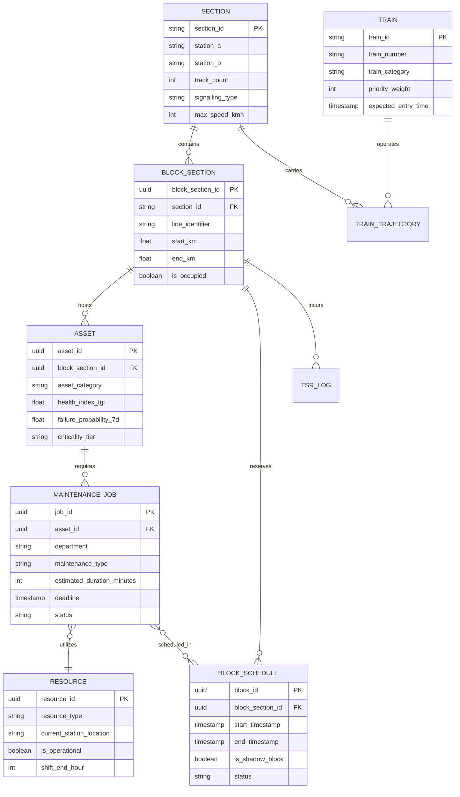

# SIH26027: AI-Powered Automatic Block Planning — Stakeholders, Regions, Assets & Data Architecture
**Project Title:** AI-Powered Automatic Block Planning to Maximize Asset Availability for Train Operations on Indian Railways  
**Problem Statement ID:** SIH26027 | **Ministry:** Ministry of Railways (Government of India)  
**Document Part:** Modules 6 to 10 (Stakeholder Matrix, Regional Adaptations, Asset Categorization, Data Model & Constraint Taxonomy)

---

## PART 6 — STAKEHOLDER ANALYSIS

A railway is an intensely multi-disciplinary socio-technical system. Block planning touches almost every department in Indian Railways. The table below details the 18 essential stakeholder groups:

| Stakeholder | Core Responsibility | Current Operational Problem | Data Generated | Data Needed | Decisions Made | Core Pain Point | Desired Outcome | System Impact & Value | Priority |
| :--- | :--- | :--- | :--- | :--- | :--- | :--- | :--- | :--- | :--- |
| **1. Railway Board** | Apex national policy, safety oversight, budget allocation, punctuality monitoring. | Inability to track true net asset availability vs. punctuality trade-offs across 17 zones. | National policies, Rolling Block circulars, budget ceilings. | Macro punctuality metrics, national maintenance backlog, safety incident reports. | Network capital allocation, national corridor policies. | Conflicting departmental reports; recurring safety inquiries after derailments. | Transparent national dashboard showing optimized maintenance compliance. | Macro-level executive reporting on network health & safety compliance. | High |
| **2. Zonal Railway (PCOM / PCE / PCEE / PCSTE)** | Inter-divisional traffic flow, zonal machine distribution, inter-zonal dispute arbitration. | Divisions dump delayed trains onto neighboring divisions; unequal track machine utilization. | Zonal train working orders, inter-divisional interchange targets. | Divisional punctuality logs, machine overhaul schedules, cross-boundary train forecasts. | Allocation of track machines between divisions, special train paths. | Inter-divisional blame games when trains arrive delayed from an adjacent zone. | Balanced cross-divisional train and block synchronization. | Inter-divisional boundary coordination & machine fleet balancing. | High |
| **3. Divisional Railway Manager (DRM / ADRM)** | Overall executive head of the Division; responsible for safety, punctuality, and revenue. | Stuck between Railway Board punctuality pressure and safety demands for track maintenance. | Divisional review minutes, administrative sanctions, budget approvals. | Divisional asset risk index, punctuality loss reports, pending block requests. | Sanctioning major corridor blocks, arbitrating inter-departmental deadlocks. | Constant pressure from Board on punctuality vs. fear of rail fractures/accidents. | Objective mathematical proof justifying why a block must be granted. | High-level decision-support dashboard showing quantified risk trade-offs. | High |
| **4. Control Office (Chief Controller / Dy. Controller)** | 24/7 supervision of all train movements and block grants across all divisional sections. | High cognitive overload; manually balancing train charts against dozens of verbal block calls. | Master train graphs, controller log sheets, unusual incident reports. | Real-time train GPS locations, verified block permits, line clear requests. | Final live operational grant or cancellation of maintenance blocks. | Extreme stress during traffic bunching; fear of being blamed for train detention. | Automated conflict-free window detection & live graphical guidance. | Real-time digital co-pilot alerting to optimal block windows & delay impacts. | **Critical** |
| **5. Operations Dept (Sr. DOM / DOM / Section Controller)** | Sectional train dispatching, platform allocation, line capacity optimization. | Primary KPI is zero train detention; incentivized to reject or shorten maintenance blocks. | Train actual run logs, precedence orders, caution order registers. | Precise machine work duration, block clearing confirmation, speed restoration time. | Train regulation, diversion, re-platforming, block grant/refusal. | Maintenance teams asking for 4 hours and overrunning by 45 minutes ("bursting"). | Guaranteed block duration with zero overrun and minimal train delay. | Automated train reschedule & reroute suggestions with delay metrics. | **Critical** |
| **6. Civil Engineering (Sr. DEN / DEN / ADEN)** | Structural integrity of track bed, rails, welds, bridges, points, and crossings. | 35% to 50% of maintenance block demands are denied by Operations, accumulating severe backlog. | Defect registers (USFD, TRC, OMS), bridge inspection logs, proposed TSRs. | Block availability schedules, machine availability, ballast train paths. | Maintenance priorities, track renewal proposals, imposing speed restrictions. | Track quality degrades to danger limits, forcing emergency TSRs (speed cuts). | Guaranteed, reliable maintenance windows to maintain full sectional speed. | Prioritized maintenance scheduling based on predictive asset risk scoring. | **Critical** |
| **7. Field P-Way Teams (SSE / JE P-Way, Gangmen)** | Physical execution of track repairs, rail replacement, tamping, deep screening on the ground. | Gangs mobilize at 02:00 AM in remote areas only to learn the block was canceled by Control. | Site completion logs, rail measurement sheets, gang muster rolls. | Exact time of block grant, physical protection clearance, machine arrival time. | On-site safety protection, track clearance certification, issuing TSR. | Wasted night shifts, fatigue, extreme physical danger from unnotified train traffic. | Predictable, honored block schedules with automated safety margin locks. | Mobile/desktop notification of confirmed block windows and machine staging. | **Critical** |
| **8. Electrical Dept (Sr. DEE / ADEE / SSE OHE)** | 25 kV AC catenary/contact wire, substations, insulators, power supply continuity. | Difficulty coordinating power isolation with traffic blocks; catenary maintenance neglected. | Wire thickness logs, thermal hotspot scans, insulator replacement logs. | Traffic block confirmations, TPC isolation permits, tower wagon paths. | Granting and canceling power isolation permits, issuing earthing certificates. | Working near live 25 kV lines without confirmed de-energization and earthing. | Synchronized "Shadow Blocks" clubbed with Civil Engineering track closures. | Automated clubbing of OHE maintenance with P-Way traffic blocks. | **Critical** |
| **9. S&T Dept (Sr. DSTE / ADSTE / SSE Signal)** | Electronic Interlocking, point machines, track circuits, signals, block instruments. | Reconnecting points after track lifting requires tedious manual coordination under pressure. | Signal failure logs, point machine motor graphs, relay test sheets. | P-Way tamping schedules, track machine passage schedules, disconnection approvals. | Issuing Form S&T (T/351) Disconnection & Reconnection notices. | Tampers cutting signal bonding cables or damaging axle counter track heads. | Advance notification to inspect and disconnect S&T gear before machines arrive. | Automated S&T disconnection workflow linked directly to tamping schedules. | **Critical** |
| **10. Track Machine Teams (Dy. CE/TM / Machine Operators)** | Operating heavy machines (Tampers, Ballast Cleaners, Rail Grinders, Dynamic Stabilizers). | Machines stranded in sidings for days waiting for blocks; inadequate continuous block lengths. | Machine engine hours, fuel logs, kilometers tamped, breakdown reports. | Block duration certainty, transit paths between stations, siding clear status. | Machine work settings, site entry and exit maneuvers, fuel replenishment. | Granted blocks are too short (<90 min) to cover machine setup and pack cycle. | Continuous 3–4 hour blocks that maximize machine productivity. | Optimization solver prioritizing continuous high-yield machine work windows. | **Critical** |
| **11. Safety Personnel (Sr. DSO / Safety Counselors)** | Enforcement of General & Subsidiary Rules (G&SR), accident prevention, safety audits. | Pressure from operations to bypass standard protection measures to save time. | Accident investigation reports, safety audit logs, rule breach notices. | Block protection compliance logs, detonator placement confirmations. | Safety clearance, accident inquiries, issuing safety circulars. | Shortcuts taken during hasty block clearance leading to derailments. | Zero safety rule violations, automated fail-safe protection verification. | System hard-constrains safety rules; cannot recommend illegal overlaps. | High |
| **12. Mechanical Dept (Carriage & Wagon / Loco)** | Train rolling stock health, wheel health, locomotive availability, brake power. | Wheel flats and axle hunting caused by neglected track joints and poor geometry. | Wheel wear profiles, hot axle detector logs, rolling stock defect sheets. | Track condition indices, emergency train diversion paths. | Rolling stock fitness certification, breakdown crane dispatch. | Derailments caused by track-train dynamic interaction on poorly tamped track. | Smooth track geometry that extends wheel and suspension lifespan. | Better track geometry reduces rolling stock damage and mechanical failures. | Medium |
| **13. Train Crew (Loco Pilots & Guards)** | Driving trains safely according to signals and speed restrictions across the section. | Frequent unexpected TSRs cause severe braking/acceleration cycles and stress. | Trip delay logs, signal defect sightings, rough riding reports. | Caution orders, temporary speed restrictions, signal aspects. | Train speed control, emergency braking, reporting track anomalies. | Sudden braking for unscheduled track workers or unexpected caution orders. | Consistent, clear caution orders and fewer speed-choking TSRs. | Optimized scheduling reduces TSR count, giving smoother running profiles. | Medium |
| **14. Maintenance Contractors** | Executing contract track renewals, ballast dumping, deep screening labor. | Idle labor penalties and equipment rental losses when railway blocks are canceled. | Contractor labor counts, daily work progress sheets, invoice claims. | Advance block schedules (7-day lookahead), site handover timestamps. | Mobilization of contract labor, heavy earthmoving equipment deployment. | Financial losses when 100 contract laborers sit idle due to sudden block refusal. | Reliable 7-day advance block schedules with minimal cancellations. | Advance candidate schedule visibility allowing reliable contractor staging. | Medium |
| **15. Freight Operations & Industrial Customers** | Movement of bulk freight (Coal, Iron Ore, Cement, Fertilizers, Container rakes). | Freight trains are the first to be stabled in loop lines for hours when blocks are taken. | Consignment tonnage, rake loading timestamps, demurrage records. | Expected transit time, delivery estimates, siding placement forecasts. | Routing of supply chains, loading schedules, coal rake dispatch. | Unpredictable freight transit times and high demurrage costs due to stabling. | Predictable freight corridors with scheduled maintenance bypass windows. | Freight-aware delay minimization ensuring core industrial flows are preserved. | High |
| **16. Passenger Services (Coaching Operations)** | Passenger train timetabling, punctuality, passenger satisfaction, platform management. | Passenger trains regulated at outer signals; passenger outrage over delayed journeys. | Passenger punctuality logs, public complaint feeds (RailMadad). | Updated train arrival estimates, platform occupancy forecasts. | Passenger announcements, catering adjustments, rake turn-around. | Loss of passenger trust, massive social media backlash, compensation claims. | Reliable passenger timetables with scheduled, notified journey times. | System prioritizes premium passenger paths, penalizing passenger delays heavily. | High |
| **17. Traveling Passengers** | Millions of daily citizens relying on Indian Railways for affordable, punctual transit. | Stranded on delayed trains for hours without information due to ad-hoc block execution. | Passenger feedback, ticket cancellations, grievances on RailMadad. | Real-time train delay status, rescheduled arrival times. | Booking travel, selecting train routes. | Missed connecting trains, missed business/medical appointments, lack of water/food. | On-time arrival and transparent advance notification if a train is rescheduled. | Minimized delay propagation; advance notification if blocks require rescheduling. | High |
| **18. Railway Executive Management (GM / AGM)** | Zonal profit/loss, operating ratio, overall safety record, infrastructure expansion. | High Operating Ratio (>98%); massive capital locked in track machines yielding low return. | Zonal balance sheets, infrastructure expenditure logs, safety metrics. | Machine return-on-capital metrics, speed restriction trends, freight revenue. | Zonal policy directives, budgetary resource reallocation. | Inability to increase average freight speeds above 25 km/h due to chronic TSRs. | Raising average freight speeds to 50 km/h and improving capital productivity. | Demonstrable increase in track machine yield and net line capacity availability. | High |

---

## PART 7 — REGIONAL DIFFERENCES ACROSS INDIAN RAILWAYS

Indian Railways is not homogeneous. A block-planning algorithm designed purely for a double-track electrified passenger line in Central India will fail completely in the coal-heavy lines of Eastern India or the suburban commuter networks of Western India.

### 7.1 Geographic & Operational Corridor Profiles

```
+-----------------------------------------------------------------------------------+
|                        REGIONAL OPERATIONAL ARCHETYPES                            |
+--------------------------+------------------------------+-------------------------+
| NORTHERN NETWORK         | EASTERN & SE-CENTRAL         | WESTERN & CENTRAL       |
| - Severe Winter Fog      | - Heavy Coal/Iron Ore        | - Dense Suburban Locals |
| - High Summer Heat       | - 25-30 Ton Axle Loads       | - Port Connectivity     |
| - Dense Passenger Trunks | - Rapid Track Wear/Degrad    | - Ghat Mountain Sections|
+--------------------------+------------------------------+-------------------------+
| SOUTHERN NETWORK         | NORTHEAST FRONTIER           | DEDICATED FREIGHT CORR. |
| - Mixed Density Lines    | - Extreme Monsoon / Floods   | - Heavy Haul (Long-Haul)|
| - Frequent Suburban Hubs | - Landslide-Prone Terrains   | - Fixed Scheduled Blocks|
| - High Maintenance Base  | - Single Line Bottlenecks    | - Pure Freight Paths    |
+--------------------------+------------------------------+-------------------------+
```

#### 1. Northern Railway (NR) & North Central Railway (NCR) — *High-Density Passenger Trunks*
* **Core Characteristics:** The Ghaziabad–Prayagraj–Pt. Deen Dayal Upadhyaya (DDU) trunk corridor handles the heaviest passenger train density in India (utilization >140%). 
* **Operational Bottlenecks:** Very narrow headway (5–8 minutes); high-speed Vande Bharat, Rajdhani, and Shatabdi expresses dominate daytime traffic.
* **Environmental Factors:**
  - **Winter Fog (Dec–Feb):** Visual range drops below 50 meters. Speeds are automatically capped at 60–75 km/h under Modified Semi-Automatic / Fog rules. Trains run 4 to 12 hours late, completely shattering planned daytime or early morning block windows.
  - **Summer Heat (May–June):** Rail temperatures exceed 65°C, surpassing the Destressing Temperature ($T_d$). High risk of **Rail Buckling (Sun Kinks)**. Track tamping or lifting during peak daytime heat is strictly prohibited by the Indian Railways Permanent Way Manual (IRPWM).

#### 2. Eastern Railway (ER), South Eastern (SER) & South East Central (SECR) — *Heavy Mineral Freight*
* **Core Characteristics:** Coal movement from Jharkhand, Odisha, and Chhattisgarh to power plants across India. Freight trains carry 25-ton axle loads in heavy BOXNHL rakes.
* **Operational Bottlenecks:** Continuous, non-cyclic freight flow. Freight trains do not have fixed published public timetables; they operate on dynamic pathing.
* **Asset Impact:** Severe rail head wear, rail corrugation, accelerated weld fatigue, and ballast pulverization under heavy axle pounding. Track requires tamping and deep screening twice as frequently as passenger lines.

#### 3. Western (WR) & Central Railway (CR) — *Suburban Commuter Systems & Ghat Terrains*
* **Core Characteristics:** Mumbai Suburban network carries 7.5 million passengers daily with a train every 3.5 minutes on quadruple/sextuple lines (Fast and Slow corridors).
* **Operational Bottlenecks:** Suburban morning peak (08:00–11:30) and evening peak (16:30–20:30) cannot tolerate a single block. All maintenance is compressed into **Sunday Mega Blocks** (typically 10:30 to 15:30) or midnight micro-windows (01:15 to 04:15).
* **Ghat Sections (Bhor Ghat / Thull Ghat):** Steep 1:37 gradients requiring catching sidings, banking locomotives, and tunnel maintenance. Track machines require specialized braking and cannot be stabled on gradient tracks.

#### 4. Southern Railway (SR) & South Western Railway (SWR) — *Mixed Passenger & Suburban*
* **Core Characteristics:** High concentration of medium-distance inter-city expresses, single-line sections feeding into twin-track junctions (e.g., Jolarpettai, Shoranur).
* **Environmental Factors:** Southwest and Northeast Monsoons bring extended wet periods, saturating the track formation (mud pumping), necessitating frequent ballast cleaning.

#### 5. Northeast Frontier Railway (NFR) — *Geographic Fragility & Single Lines*
* **Core Characteristics:** Long single-line sections with limited crossing loops. A single maintenance block halts traffic in both directions across the entire section.
* **Environmental Factors:** Extreme torrential rainfall, flash floods, scouring of bridge piers, and hill-slope landslides. Maintenance is heavily bridge- and earthwork-centric.

---

### 7.2 Generic, Regionally Configurable Architecture
To make our SIH solution scalable across all 17 zones, the system must **never hardcode operational parameters**. Instead, it utilizes a **Corridor Configuration Profile (CCP)**:

```json
{
  "corridor_id": "NCR-DDU-PRYJ-MAIN",
  "zone": "North Central Railway",
  "track_type": "Double_Electrified_Automatic",
  "ambient_season": "Winter_Fog",
  "seasonal_rules": {
    "fog_rules_active": true,
    "max_speed_cap_kmh": 75,
    "daytime_block_allowed": false,
    "rail_temp_limits": { "min_celsius": 5, "max_celsius": 55 }
  },
  "traffic_priority_profile": {
    "passenger_punctuality_weight": 0.90,
    "freight_delay_penalty_weight": 0.10,
    "suburban_peak_lockout_windows": []
  },
  "machine_stabling_rules": {
    "requires_refuge_siding": true,
    "max_transit_distance_km": 35
  }
}
```

---

## PART 8 — ASSET TYPES & CRITICALITY HIERARCHY

Maintenance blocks are requested to service specific physical components of railway infrastructure. The table below categorizes the complete asset landscape:

```
+-----------------------------------------------------------------------------------+
|                        RAILWAY INFRASTRUCTURE ASSET SPECTRUM                      |
+--------------------+--------------------+--------------------+--------------------+
| TRACK / P-WAY      | ELECTRICAL (TRD)   | S & T              | CIVIL STRUCTURES   |
| - Rails & Welds    | - Contact Wire     | - Point Machines   | - Bridges & Girders|
| - Sleepers         | - Catenary Wire    | - Signals & Aspect | - Tunnels & Drains |
| - Ballast Bed      | - Cantilevers      | - Track Circuits   | - Level Crossings  |
| - Points/Crossings | - Substations/FP   | - Axle Counters    | - Track Machines   |
+--------------------+--------------------+--------------------+--------------------+
```

### 8.1 Exhaustive Asset Breakdown

| Asset Category | Specific Component | Maintenance Requirement | Typical Failure Modes | Block Required? | Primary Resources Required | Key Operational Constraints | Criticality | Condition-Monitoring Data Source | MVP Scope? |
| :--- | :--- | :--- | :--- | :--- | :--- | :--- | :--- | :--- | :--- |
| **1. Track (P-Way)** | **Continuous Welded Rail (CWR)** | Rail grinding, destressing, rail renewal, flaw excision. | Transverse fatigue fissures, head checks, weld fractures, shelling. | **Yes (Traffic)** | Rail Grinding Machine (RGM), Flash Butt Welder, P-Way gang. | Strict rail temperature limits ($T_d \pm 5^\circ\text{C}$); cannot weld in heavy rain. | **Extreme** | USFD flaw logs, OMS acceleration peaks, Track Recording Car (TRC). | **YES (Core)** |
| **2. Track (P-Way)** | **Sleepers & Fastenings** | Sleeper replacement, Elastic Rail Clip (ERC) greasing, pad renewal. | Cracked PSC sleepers, missing clips, broken rubber pads, gauge widening. | **Yes (Traffic)** | T-28 machine or manual gang, sleeper carrier rake. | Track geometry compromised during replacement; requires post-work TSR. | **High** | Visual foot patrol, OMS vertical acceleration, Track Management System (TMS). | **YES (Core)** |
| **3. Track (P-Way)** | **Ballast Bed & Formation** | Ballast cleaning (BCM), tamping, dynamic stabilization, ballast dumping. | Ballast fouling (mud pumping), lack of cushion, track settlement, voids. | **Yes (Traffic + Power)** | BCM, Dynamic Track Stabilizer (DGS), 09-3X Tamper, Ballast Hopper Train (BOBYN). | Heavy machines occupy adjacent track clearance; lifts track height (affects OHE). | **Extreme** | Track Geometry Index (TGI), Ground Penetrating Radar (GPR), TRC runs. | **YES (Core)** |
| **4. Track (P-Way)** | **Points & Crossings (P&X)** | Turnout tamping, tongue rail renewal, CMS crossing reconditioning. | Chipped tongue rails, worn crossing nose, point alignment distortion. | **Yes (Traffic + Disconnection)** | Unimat / Point Tamping Machine, S&T signal technician, welder. | Shuts down multiple routing options across an entire station yard. | **Extreme** | Visual inspection, turnout wear gauges, Point machine current curves. | **YES (Core)** |
| **5. Civil Works** | **Railway Bridges & Culverts** | Girder painting, bearing replacement, bed block repair, channel cleaning. | Corroded steel girders, cracked masonry piers, bridge scour during floods. | **Yes (Traffic)** | Mobile bridge crane, scaffold crews, riveters, torque wrenches. | Requires long continuous blocks (4–8 hours); cannot be done in micro-windows. | **High** | Annual bridge inspection registers, underwater acoustic scour sensors. | Future Scope |
| **6. Civil Works** | **Tunnels & Cuttings** | Rock bolt testing, seepage drainage clearing, structural lining check. | Falling boulders, water ingress causing track short-circuits, lining cracks. | **Yes (Traffic)** | Tunnel inspection car, shotcrete pump, drainage cleaning crews. | Confined spatial footprint; poor lighting; hazardous escape routes. | High | Ultrasonic tunnel wall scanners, geological seepage sensors. | Future Scope |
| **7. Electrical (TRD)** | **Contact & Catenary Wire** | Height/stagger adjustment, contact wire replacement, dropper retensioning. | Contact wire thinning, snapped droppers, wire parting under pantograph arc. | **Yes (Power + Traffic)** | Tower Wagon (RU/8-Wheeler), Wiring Train, TRD line gang. | Must de-energize 25 kV AC; requires earthing discharge rods; tower wagon blocks track. | **Extreme** | OHE-AMS wire thickness measurements, Current Collection Test (CCT). | **YES (Core)** |
| **8. Electrical (TRD)** | **OHE Masts & Cantilevers** | Cantilever insulator cleaning, mast alignment, bracket replacement. | Flashovers from polluted insulators, bent cantilever tubes, loose stay arms. | **Yes (Power)** | Tower wagon, ladder trolleys, insulator washing rig. | Can sometimes be done under "Power Block only" while diesel trains run below. | **Medium** | Thermal imaging hotspot logs, visual foot patrols. | Future Scope |
| **9. Electrical (TRD)** | **Traction Substations (TSS)** | Circuit breaker overhauls, transformer oil filtration, SCADA testing. | Transformer explosion, circuit breaker tripping, lightning arrester puncture. | **No (Electrical Feed Switching)** | Electrical substation engineers, oil test rigs. | Power can be fed from adjacent TSS via bus-coupler bridging without line block. | Medium | SCADA telemetry logs, dissolved gas analysis (DGA). | Future Scope |
| **10. S&T** | **Point Machines & Drives** | Lubrication, internal gear cleaning, motor current tuning, clutch testing. | Sluggish motor operation, failure to detect end-position, broken detector rod. | **Yes (Disconnection)** | Signal maintainer gang, S&T officer, electrical multimeter. | Requires issuing Form S&T (T/351); locks affected route to Danger. | **Extreme** | Point machine current signature monitoring, SMMS failure logs. | **YES (Core)** |
| **11. S&T** | **Signals & Aspect Units** | LED aspect lamp replacement, signal focusing, cable insulation testing. | Dark signal (lamp failure), cable short circuit, wrong aspect display. | **Yes (Disconnection)** | Signal maintainer, cable testing crew. | Trains must be piloted past dark signals on Paper Line Clear tickets. | High | Integrated power supply (IPS) telemetry, SMMS logs. | Future Scope |
| **12. S&T** | **Track Circuits & Axle Counters** | Glued joint cleaning, bond wire renewal, wheel sensor tuning, reset box check. | False track occupancy (red block), broken bond wire, damaged axle counter head. | **Yes (Disconnection)** | S&T maintainer, P-Way keyman. | Halts all automatic signals in section; forces manual train piloting at 15 km/h. | **Extreme** | Track circuit voltage telemetry, Digital Axle Counter (DAC) error logs. | **YES (Core)** |
| **13. S&T** | **Interlocking & Cabling** | Relay testing, Electronic Interlocking (EI) software card testing, OFC checks. | System lockup, lightning surge damage to cards, sliced optical fiber cables. | **Yes (Disconnection)** | S&T systems engineer, OEM technician. | Completely freezes station operations; requires full manual cranking of points. | **Extreme** | Electronic Interlocking event logger data, diagnostic fault registers. | Future Scope |
| **14. Station Infrastructure** | **Level Crossing (LC) Gates** | Boom replacement, road surface paving, lifting barrier drive servicing. | Broken boom from road vehicle collision, jammed locking pin, winch wire snap. | **Yes (Traffic)** | P-Way gang, gate maintainer, road barrier crew. | Halts road traffic; if interlocked, prevents train signals from clearing. | High | Gate failure registers, road traffic census logs. | Future Scope |
| **15. Machinery Assets** | **Track Maintenance Machines** | Tamping bank overhaul, cutter chain tooth renewal, hydraulic hose checks. | Hydraulic hose burst on main line, engine seizure, tamping tool breakage. | **No (Requires Siding)** | Machine maintenance mechanics, hydraulic test rigs. | A broken machine cannot clear the main line without an emergency rescue loco! | **Extreme** | SATMS machine telemetry, engine vibration sensors. | **YES (Core)** |

### 8.2 Strategic Recommendation: MVP vs. Future Scope
* **Recommended MVP Scope:** Focus on the high-yield, high-frequency **Core Triad**:
  1. **Civil P-Way:** Continuous Welded Rail (tamping, flaw repairs) and Turnouts (Points & Crossings).
  2. **Electrical TRD:** Overhead Equipment (OHE contact wire maintenance under Power Block).
  3. **Signalling (S&T):** Point machine testing, Track circuits, and Axle counter protection under Disconnection.
  4. **Track Machines:** CSM / 09-3X Tamping machines and Tower Wagons.
* **Why this scope?** This triad represents **over 85% of all daily maintenance block requests** on Indian Railways. Solving this core triad proves the full multi-departmental mathematical optimization concept without getting bogged down in edge-case bridge or tunnel mechanics.

---

## PART 9 — COMPLETE DATA MODEL & ENTITY ARCHITECTURE

To feed mathematical optimization solvers and simulation engines, the data model must capture physical railway topology, commercial timetables, asset degradation states, maintenance work orders, and mobile resource availability:

### 9.1 Core Entities & Attribute Schema

#### 1. `Section` (Physical railway corridor between major junctions)
* `section_id` (PK, UUID / String): Unique identifier (e.g., `"SEC_GZB_ALJN"`).
* `station_a` (String): Origin station code (e.g., `"GZB"`).
* `station_b` (String): Destination station code (e.g., `"ALJN"`).
* `total_length_km` (Float): Physical length in kilometers.
* `track_count` (Integer): Number of running lines (e.g., `2` for double track, `4` for quadruple).
* `electrification_type` (Enum): `25KV_AC`, `NON_ELECTRIFIED`.
* `signalling_system` (Enum): `AUTOMATIC_BLOCK`, `ABSOLUTE_BLOCK`, `CENTRALIZED_CTC`.
* `max_sectional_speed_kmh` (Integer): Maximum permissible speed (e.g., `130`).
* `ruling_gradient` (String): Maximum slope (e.g., `"1:150"`).

#### 2. `BlockSection` (Atomic track segment controlled by signals)
* `block_section_id` (PK, UUID): e.g., `"BLK_KRJ_DAR_DN_01"`.
* `section_id` (FK): Parent corridor section.
* `line_identifier` (Enum): `UP_MAIN`, `DOWN_MAIN`, `THIRD_LINE`, `LOOP_1`.
* `start_km` (Float): e.g., `124.500`.
* `end_km` (Float): e.g., `132.800`.
* `is_occupied` (Boolean): Live state from track circuit/axle counter.
* `is_power_isolated` (Boolean): Live state of 25 kV catenary.

#### 3. `Asset` (Physical infrastructure component requiring upkeep)
* `asset_id` (PK, UUID): e.g., `"AST_RAIL_NCR_128_DN"`.
* `block_section_id` (FK): Geographic location.
* `asset_category` (Enum): `TRACK_PWAY`, `ELECTRICAL_TRD`, `SIGNAL_ST`.
* `asset_type` (String): `"CWR_60KG_90UTS"`, `"OHE_CONTACT_107SQMM"`, `"POINT_MACHINE_143MM"`.
* `installation_date` (Date): Commissioning date.
* `cumulative_gmt` (Float): Gross Million Tonnes carried since installation.
* `health_index_tgi` (Float): Track Geometry Index / Condition rating (0–100).
* `failure_probability_7d` (Float): Predictive ML output (0.00 to 1.00).
* `criticality_tier` (Enum): `TIER_1_SAFETY_CRITICAL`, `TIER_2_RESTRICTION_RISK`, `TIER_3_ROUTINE`.

#### 4. `Train` (Scheduled or dynamic commercial movement)
* `train_id` (PK, String): e.g., `"12004"`, `"CONT_90412"`.
* `train_number` (String): Indian Railways 5-digit number or freight ID.
* `train_name` (String): e.g., `"Lucknow Swarna Shatabdi Express"`.
* `train_category` (Enum): `PREMIUM_PASSENGER`, `MAIL_EXPRESS`, `SUBURBAN`, `PARCEL`, `LOADED_FREIGHT`, `EMPTY_FREIGHT`.
* `priority_weight` (Integer): Operational priority (e.g., Vande Bharat = `100`, Freight = `20`).
* `origin_station` (String): e.g., `"NDLS"`.
* `destination_station` (String): e.g., `"LKO"`.
* `scheduled_entry_time` (Timestamp): Timetabled arrival at section boundary.
* `expected_entry_time` (Timestamp): Dynamic live estimate factoring upstream delays.
* `max_speed_kmh` (Integer): Maximum authorized train speed (e.g., `130`).
* `length_meters` (Float): e.g., `650.0` (critical for loop line accommodation).

#### 5. `MaintenanceJob` (Work order demanding track possession)
* `job_id` (PK, UUID): e.g., `"JOB_PWAY_TMP_2026_091"`.
* `asset_id` (FK): Component undergoing maintenance.
* `department` (Enum): `CIVIL_ENGINEERING`, `ELECTRICAL_TRD`, `ST_SIGNALLING`.
* `maintenance_type` (Enum): `TAMPING`, `BALLAST_CLEANING`, `OHE_RESTORATION`, `POINT_OVERHAUL`, `RAIL_GRINDING`.
* `required_block_type` (Enum): `TRAFFIC_ONLY`, `POWER_ONLY`, `COMBINED_TRAFFIC_POWER`, `DISCONNECTION`.
* `estimated_duration_minutes` (Integer): Nominal duration requested (e.g., `180`).
* `minimum_viable_duration_minutes` (Integer): Minimum threshold below which work is unviable (e.g., `120`).
* `deadline_timestamp` (Timestamp): Statutory deadline before emergency TSR must be imposed.
* `status` (Enum): `DEMAND_LOGGED`, `OPTIMIZED`, `APPROVED`, `IN_EXECUTION`, `COMPLETED`, `CANCELLED`.

#### 6. `Resource` (Mobile machine, gang, or material rake)
* `resource_id` (PK, UUID): e.g., `"MCH_CSM_912"`.
* `resource_type` (Enum): `TRACK_MACHINE`, `TOWER_WAGON`, `PWAY_GANG`, `S_AND_T_GANG`, `MATERIAL_TRAIN`.
* `home_base_station` (String): Location of maintenance siding where resource is stabled.
* `current_station_location` (String): Real-time location.
* `is_operational` (Boolean): Fitness state.
* `certified_speed_kmh` (Integer): Self-propelled transit speed (e.g., `50` km/h for CSM).
* `shift_start_hour` (Integer): Crew work shift constraints (e.g., `22:00`).
* `shift_end_hour` (Integer): e.g., `06:00`.

#### 7. `BlockSchedule` (The optimized or executed possession window)
* `block_id` (PK, UUID): e.g., `"BLK_SCH_2026_0906_01"`.
* `block_section_id` (FK): Geographic stretch.
* `start_timestamp` (Timestamp): Scheduled start time.
* `end_timestamp` (Timestamp): Scheduled finish time.
* `actual_start_timestamp` (Timestamp, Nullable): Recorded execution start.
* `actual_end_timestamp` (Timestamp, Nullable): Recorded execution clear.
* `is_shadow_block` (Boolean): True if multiple jobs are bundled.
* `bundled_job_ids` (Array of FKs): List of coordinated `MaintenanceJob` records.
* `allocated_resource_ids` (Array of FKs): Assigned machines and crews.
* `approval_officer_id` (String): DOM digital signature authorization.
* `status` (Enum): `TENTATIVE`, `RECOMMENDED`, `COMMITTED`, `BURSTED`, `SUCCESSFUL`.

#### 8. `TSR_Log` (Temporary Speed Restrictions resulting from track condition or maintenance)
* `tsr_id` (PK, UUID): Unique restriction log.
* `block_section_id` (FK): Location.
* `imposed_speed_kmh` (Integer): Restricted speed (e.g., `30` km/h vs. normal `130` km/h).
* `imposition_reason` (String): e.g., `"Post-tamping ballast stabilization"`.
* `created_at` (Timestamp): Time imposed.
* `expected_removal_at` (Timestamp): Scheduled expiration after required gross tonnage passes.

---

### 9.2 Entity-Relationship (ER) Architecture



---

## PART 10 — PARAMETERS AND CONSTRAINT TAXONOMY

The core of our mathematical block-planning engine is a rigorous separation between physical/safety invariants that can **never be violated** under any circumstance, and operational preferences that can be **relaxed with an associated penalty cost**.

### 10.1 Comprehensive Parameter Taxonomy

```
+-----------------------------------------------------------------------------------+
|                        PARAMETER INPUT CATEGORIES                                 |
+--------------------------+------------------------------+-------------------------+
| TRAIN PARAMETERS         | ASSET PARAMETERS             | MAINTENANCE PARAMETERS  |
| - Commercial Priority    | - Current Degradation (TGI)  | - Minimum Viable Time   |
| - Dynamic Delays         | - Failure Probability (ML)   | - Setup & Packing Time  |
| - Decel / Accel Rates    | - Cumulative Tonnes (GMT)    | - Post-work TSR Speed   |
+--------------------------+------------------------------+-------------------------+
| RESOURCE PARAMETERS      | INFRASTRUCTURE               | SAFETY & ENVIRONMENTAL  |
| - Machine Siding Loc.    | - Headway / Block Length     | - OHE Power Isolation   |
| - Machine Transit Speed  | - Loop Length / Stabling     | - Rail Temp vs Td       |
| - Gang Shift Limits      | - Crossover Locations        | - Fog / Monsoon Status  |
+--------------------------+------------------------------+-------------------------+
```

1. **Train Parameters:** Timetabled arrival/departure, live GPS position, train class priority weight, passenger occupancy vs. freight gross trailing load, maximum decelerating/accelerating braking distance.
2. **Asset Parameters:** Component age, physical wear measurements (USFD flaw severity, OHE contact wire thickness, point machine motor current), spatial GPS/kilometer coordinates.
3. **Maintenance Parameters:** Minimum setup time (e.g., 20 mins to unlimber tamping tools), active working time, track clearing/packing time (20 mins), whether the job leaves a lingering TSR.
4. **Resource Parameters:** Machine physical location, certified self-propelled machine speed, fuel endurance, specialized gang availability, operator duty hour limits (max 10 hours per Indian Railways Hours of Employment Regulations - HOER).
5. **Infrastructure Parameters:** Double line vs. single line vs. 3rd line, crossover switch layout (ability to run wrong-line single-line working), loop line clearance lengths (686m/715m).
6. **Safety Parameters:** Absolute block minimum headway margins, 25 kV AC safe electrical clearance (minimum 2.0 meters), detonator protection spacing (1200 meters).
7. **Environmental Parameters:** Ambient rail temperature ($T_r$), destressing temperature ($T_d$), visibility distance (fog indicators), rainfall intensity (scour alerts).
8. **Operational Parameters:** Section Controller shift handover windows (avoid blocks during shift change at 06:00, 14:00, 22:00), suburban morning/evening peak lockout hours.
9. **Historical Parameters:** Historical block overrun probability for specific gangs or machines, historical delay absorption capacity of specific trains.

---

### 10.2 HARD CONSTRAINTS (Absolute Invariants — Solver Must NEVER Violate)

```
[SAFETY CRITICAL INVARIANTS]
   |--> Spatial Exclusivity: Train Path ∩ Maintenance Block = ∅
   |--> Electrical Protection: OHE Maintenance ==> Power Block Verified
   |--> Machine Physics: Transit Time + Setup Time + Pack Time ≤ Block Duration
   |--> Human Rest: Gang Work Hours ≤ HOER Statutory Limits
   |--> Thermal Rules: Tamping Forbidden when Rail Temp Tr > Td + 20°C
```

* **HC-1: Spatial-Temporal Exclusivity (No Train-Block Collision):**
  A commercial train path $T_i$ and a maintenance block $B_k$ can **never** occupy the same physical `BlockSection` simultaneously:
  $$\forall i, k: \quad \text{BlockSection}(T_i) = \text{BlockSection}(B_k) \implies \left[E(T_i) + h_{\min} \le S(B_k)\right] \;\lor\; \left[E(B_k) + h_{\min} \le S(T_i)\right]$$
  *(Where $h_{\min}$ is the statutory minimum safety headway buffer, typically 7 to 10 minutes).*

* **HC-2: Mandatory Electrical Power Isolation:**
  No personnel or mobile equipment may work within 2 meters of the 25 kV OHE without a certified Power Block:
  $$\forall j \in \text{Jobs}: \quad \text{RequiresOHEContact}(j) = \text{True} \implies \text{PowerBlockState}(\text{Section}(j)) = \text{ISOLATED\_AND\_EARTHED}$$

* **HC-3: Machine Resource Non-Teleportation & Uniqueness:**
  A track machine $M_m$ can be assigned to at most one job at a time, and the time gap between two consecutive jobs at different locations must be greater than or equal to the machine's transit travel time:
  $$S(j_2) - E(j_1) \ge \text{TransitTime}(M_m, \text{Loc}(j_1), \text{Loc}(j_2)) \quad \forall j_1, j_2 \text{ assigned to } M_m$$

* **HC-4: Minimum Viable Block Duration:**
  A block cannot be granted for less than the irreducible physical setup, execution, and site clearance time:
  $$\text{Duration}(B_k) \ge \text{SetupTime}(j) + \text{MinimumExecutionTime}(j) + \text{PackingTime}(j)$$
  *(If available window is 60 minutes and minimum viable time is 90 minutes, the optimizer must NOT schedule the job).*

* **HC-5: Absolute Rail Temperature Thresholds (IRPWM Para 812):**
  Heavy track maintenance (destressing, tamping, lifting) cannot occur if the rail temperature $T_r$ exceeds the safety envelope relative to the destressing temperature $T_d$:
  $$\text{If } j \in \{\text{Tamping}, \text{Deep Screening}\}: \quad T_r \in [T_d - 30^\circ\text{C}, \; T_d + 10^\circ\text{C}]$$
  *(Violating this causes instant catastrophic rail buckling under summer heat or rail fractures under extreme winter frost).*

* **HC-6: Interlocking Safety Disconnection:**
  Any work affecting points, crossings, or track circuits requires an active S&T Disconnection Notice (Form S&T T/351) locking affected route signals to the Danger (Red) state.

* **HC-7: Statutory Labor Hours (HOER Compliance):**
  Workforce gang assignments cannot exceed statutory continuous duty limits (maximum 10 hours per shift without mandatory rest).

---

### 10.3 SOFT CONSTRAINTS (Operational Trade-offs — Penalized in Objective Function)

```
[OPERATIONAL PREFERENCE BOUNDARIES]
   |--> Minimize Premium Passenger Train Delay (Heavy Penalty)
   |--> Maximize Multi-Departmental Shadow Block Bundling (Reward Bonus)
   |--> Prevent Maintenance Deadlines from Expiring (Heavy Penalty)
   |--> Avoid Block Fragmentation (Prefer Contiguous 3-hr over two 1.5-hr)
   |--> Respect Daytime/Nighttime Workforce Preferences (Minor Penalty)
```

* **SC-1: Minimize Delay to High-Priority Trains:**
  Passenger trains (especially Premium Rajdhani/Vande Bharat) should not be regulated, delayed, or looped unless mathematically unavoidable. Delay is penalized proportionally to train priority weight $W_{\text{train}}$:
  $$\text{Penalty} = \sum_{t} W_{\text{train}}(t) \cdot \max\left(0, \; \text{ActualArrival}(t) - \text{ScheduledArrival}(t)\right)$$

* **SC-2: Maximize Shadow Block Bundling (Cross-Departmental Clubbing):**
  When a Civil Engineering block is granted, Electrical (OHE) and Signalling (S&T) jobs in the same physical zone should be scheduled concurrently to eliminate redundant closures:
  $$\text{Reward} = \sum_{B_k} \left(\text{Count}(\text{JobsInBlock}(B_k)) - 1\right) \cdot R_{\text{shadow}}$$

* **SC-3: Prevent Maintenance Backlog & Expiration:**
  If an asset's condition index (TGI) or predictive failure risk approaches its deadline, delaying the maintenance job incurs an escalating penalty:
  $$\text{Penalty} = \sum_{j \notin \text{Scheduled}} \text{RiskScore}(j) \cdot \exp\left(\frac{\text{CurrentTime} - \text{Deadline}(j)}{\tau}\right)$$

* **SC-4: Minimize Block Fragmentation:**
  A single continuous 3.5-hour block is vastly superior to three disjoint 70-minute blocks (because machine setup/clearing overhead is incurred only once). Fragmented small blocks are penalized.

* **SC-5: Avoid Peak Suburban & Commuter Windows:**
  Blocks should not be scheduled during regional peak commuter hours (e.g., 08:00–11:00 and 17:00–20:00 near major metropolitan terminals).

* **SC-6: Machine Siding Proximity Preference:**
  Prefer assigning maintenance jobs located closest to the machine's current stabling siding to minimize empty run kilometers.
