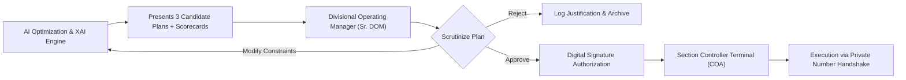

# SIH26027: AI-Powered Automatic Block Planning — Evaluation, UI, Stack & Governance
**Project Title:** AI-Powered Automatic Block Planning to Maximize Asset Availability for Train Operations on Indian Railways  
**Problem Statement ID:** SIH26027 | **Ministry:** Ministry of Railways (Government of India)  
**Document Part:** Modules 17 to 23 (Experimental Baselines, Explainable AI, Human-in-the-Loop, UI/UX Dashboard, Tech Stack, Data Framework & Safety Architecture)

---

## PART 17 — BASELINE COMPARISON & EXPERIMENTAL METHODOLOGY

To scientifically evaluate our system and convince discerning SIH evaluators, we establish three distinct operational baselines and test them across rigorously controlled, statistically reproducible scenarios:

```
+-----------------------------------------------------------------------------------+
|                           THREE-TIER EVALUATION BENCHMARK                         |
+--------------------------+------------------------------+-------------------------+
| BASELINE 1: MANUAL-LIKE  | BASELINE 2: GREEDY RULES     | BASELINE 3: PROPOSED    |
| - Emulates human DOM     | - First-Come, First-Served   | - Multi-Objective       |
| - Rejection upon bunching| - Simple priority sorting    | - Google OR-Tools CP-SAT|
| - Ad-hoc duration cuts   | - No shadow bundling         | - Predictive buffers    |
+--------------------------+------------------------------+-------------------------+
```

### 17.1 Quantitative Evaluation Metrics
We measure system performance across **10 objective operational indicators**:

1. **Net Asset Availability Index (NAAI %):** Percentage of total track-kilometer-hours operating at full authorized sectional speed without TSR or unplanned closure.
2. **Total Commercial Train Delay (Minutes):** Cumulative sum of terminal arrival delays incurred across all trains.
3. **Average Train Delay per Train (Minutes):** $\frac{\text{Total Delay}}{\text{Total Trains Run}}$.
4. **Count of Affected Trains:** Number of trains suffering $> 10$ minutes delay due to maintenance.
5. **Maintenance Demand Service Rate (%):** $\frac{\text{Demands Executed}}{\text{Demands Logged}} \times 100$.
6. **Maintenance Lateness / Backlog Days:** Cumulative days maintenance jobs remained pending beyond their statutory deadlines.
7. **Block Utilization Efficiency (%):** Ratio of actual productive machine work time to total line closure duration.
8. **Shadow Block Bundling Ratio:** $\frac{\text{Total Bundled Jobs}}{\text{Total Physical Block Windows}}$.
9. **Block Bursting / Overrun Rate (%):** Percentage of granted blocks that overstayed their allotted window.
10. **Replanning Solver Latency (Seconds):** Wall-clock time required to recompute a valid schedule after a disruption.

---

### 17.2 Statistical Scenario Generation Methodology
To avoid "cherry-picking" easy timetable gaps, we generate test sets using **Monte Carlo Latin Hypercube Sampling** across four variance parameters:
* **Train Delay Injection:** Exponential distribution ($\lambda = 0.05$) representing upstream freight and passenger entry delays (0 to 90 minutes).
* **Machine Breakdown Probability:** Bernoulli trial ($p = 0.08$) representing mid-work mechanical failures.
* **Duration Overrun Perturbation:** Log-normal distribution ($\mu = 0.15, \sigma = 0.25$) added to manual execution times.
* **Traffic Density Variations:** Three load levels:
  - *Standard Day:* 45 trains / 24 hours.
  - *Saturated Trunk Corridor:* 75 trains / 24 hours (130% line capacity utilization).
  - *Severely Congested / Disrupted:* 90 trains / 24 hours with bunching.

---

## PART 18 — EXPLAINABLE AI (XAI) & DECISION REASONING

Railway controllers are personally liable for accidents and severe disruptions. They will **never** accept a black-box AI recommendation. Our system features a dedicated **Explainability Engine** providing transparent mathematical and operational rationale:

```
+-----------------------------------------------------------------------------------+
|                        OPERATOR EXPLAINABILITY SCORECARD                          |
+-----------------------------------------------------------------------------------+
| RECOMMENDATION: Block Window 02:10 - 03:40 (90 Mins) at Km 124-128 Down Line     |
| SCORE: 92/100  |  CONFIDENCE: 94%  |  PROJECTED DELAY: 12 Mins (1 Freight Train)  |
+-----------------------------------------------------------------------------------+
```

### 18.1 Structural Explanation Breakdown
For every generated block recommendation, the system presents an interactive breakdown:

```
[WHY THIS WINDOW WAS SELECTED]
  [+] High Asset Risk: Track Geometry Index is at 62 (approaching safety threshold 60).
  [+] Optimal Traffic Valley: Natural 110-minute gap between Train 12424 (Dep 01:50) and Train 12562 (Arr 03:55).
  [+] Machine Logistics: CSM Tamper No. 912 is currently stabled at Khurja Siding (only 12 km transit).
  [+] Cross-Departmental Synergy: Electrical OHE crew has logged wire inspection on the exact same span.
      --> Both jobs bundled! Saved 90 minutes of separate daytime track closure.
  [+] Negligible Commercial Impact: Only Freight Train BCN-E is regulated for 12 minutes in loop line.
      --> Zero passenger trains delayed!
```

---

### 18.2 Multi-Alternative Trade-off Matrix (Plan A vs. Plan B vs. Plan C)
The operator is never forced into a single choice; the system provides three distinct Pareto-optimal candidates:

| Candidate Option | Proposed Time Window | Jobs Completed | Delay Impact | Pros | Cons / Trade-offs | Recommendation Score |
| :--- | :--- | :--- | :--- | :--- | :--- | :--- |
| **Plan A (Recommended)** | **02:10 – 03:40 (90 min)** | 2 Jobs (P-Way + OHE Bundled) | 12 min (1 Freight train delayed) | Maximum asset availability; zero passenger delay; high machine efficiency. | Requires night shift maintenance crew. | **92 / 100** |
| **Plan B (Daytime Alternate)** | **11:15 – 12:30 (75 min)** | 1 Job (P-Way Only) | 48 min (2 Express passenger trains delayed) | Preferred daytime working hours for workforce; better visibility. | Delays passenger trains; cuts block duration; leaves OHE work uncompleted. | **68 / 100** |
| **Plan C (Deferred Weekend)** | **Sunday 10:00 – 13:00 (180 min)** | 3 Jobs (Integrated Mega Block) | 140 min (4 Express trains diverted) | Continuous 3-hour machine window; maximum physical work output. | Asset operates at high risk for another 4 days; severe passenger disruption. | **54 / 100** |

---

## PART 19 — HUMAN-IN-THE-LOOP (HITL) & GOVERNANCE ARCHITECTURE

The platform is designed strictly as an **Intelligent Decision-Support System (DSS)**, preserving the statutory command authority of railway officers.



### 19.1 Role-Based Access Control (RBAC) Matrix

| User Role | Indian Railways Designation | Access Level | Permissions & Capabilities | Audit Logging |
| :--- | :--- | :--- | :--- | :--- |
| **1. Executive Viewer** | DRM, ADRM, GM, Railway Board | Read-Only | View high-level division dashboards, punctuality metrics, asset risk trends. | Read access logged. |
| **2. Operations Controller** | Sr. DOM, DOM, Chief Controller | **Full Approval** | Approve, modify, or reject AI block recommendations; issue Daily Block Circulars. | **Digitally signed cryptographic log.** |
| **3. Section Controller** | Shift Section Controller | Real-Time Execution | Grant, hold, or shift active blocks; exchange Private Numbers with field staff. | Real-time action audit trail. |
| **4. Engineering Supervisor** | Sr. DEN, ADEN, SSE (P-Way) | Demand & Review | Log track maintenance demands, review proposed windows, verify machine transit. | Demand modification logged. |
| **5. Electrical Supervisor** | Sr. DEE, ADEE, SSE (OHE) | Demand & Review | Log OHE maintenance demands, verify power isolation boundaries, co-sign shadow blocks. | Isolation signature logged. |
| **6. Signalling Supervisor** | Sr. DSTE, ADSTE, SSE (Signal) | Demand & Review | Log gear testing rosters, generate S&T Form T/351 Disconnection notices. | Disconnection timestamp logged. |
| **7. Machine Manager** | Dy. CE/TM, SSE (Track Machines) | Fleet Logistics | Update track machine fitness, fuel status, operator duty rosters, stabling locations. | Resource status change logged. |
| **8. System Administrator** | CRIS / IT Administrator | System Admin | Manage user accounts, configure corridor profiles, adjust solver timeout parameters. | Full administrative audit trail. |

---

## PART 20 — USER INTERFACE & DASHBOARD SPECIFICATIONS

The front-end user experience is engineered for the high-stress, multi-screen environment of an Indian Railways Divisional Control Office:

```
+-----------------------------------------------------------------------------------+
|                        DIVISIONAL CONTROL DASHBOARD LAYOUT                        |
+-----------------------------------------------------------------------------------+
| [TOP BAR: Live Network Health | Net Asset Availability: 89.1% | Active Blocks: 4] |
+------------------------------------+----------------------------------------------+
| LEFT PANEL (40%): GIS CORRIDOR MAP | RIGHT PANEL (60%): DYNAMIC STRING CHART     |
| - Live train positions (color-coded)| - Time (X-axis) vs Distance (Y-axis)         |
| - Track asset risk heatmap (Red/Grn)| - Train trajectories plotted as lines       |
| - Machine stabling sidings         | - Maintenance blocks shaded as colored boxes |
| - Active power isolation boundaries| - Interactive drag-and-drop what-if testing  |
+------------------------------------+----------------------------------------------+
| BOTTOM PANEL: PENDING AI RECOMMENDATIONS & DECISION-SUPPORT SCORECARDS            |
| [Block Rec #1: Km 124-128 | Score: 92/100 | Click to Inspect Trade-off | APPROVE] |
+-----------------------------------------------------------------------------------+
```

### 20.1 Core Dashboard Views

#### View 1: Interactive Time-Distance String Chart (Train Graph)
* **Visual Metaphor:** The standard Indian Railways "Master Chart" (Distance on vertical axis, Time across horizontal 24-hour axis).
* **Train Trajectories:** Slanted lines representing train paths (Green = Vande Bharat/Rajdhani, Blue = Express, Orange = Freight).
* **Maintenance Blocks:** Translucent rectangular bands overlaid across specific station-to-station spans.
  - Purple Hatching = Engineering P-Way Track Block.
  - Yellow Hatching = Electrical TRD Power Block.
  - Striped Purple/Yellow = Synchronized Integrated Shadow Block!
* **Interactivity:** Hovering over a block displays the asset condition, assigned machine, and exact predicted delay.

#### View 2: Multi-Layer GIS Railway Network Map
* Powered by **MapLibre / Leaflet** with OpenStreetMap railway infrastructure overlays.
* Shows real-time train positions using live synthetic GPS coordinates.
* Displays track asset condition as a color-coded gradient (Green = Excellent, Amber = Maintenance Due, Red = High Risk / Impending Failure).
* Highlights stabling sidings holding track machines and material hoppers.

#### View 3: What-If Simulation & Dynamic Replanning Sandbox
* Allows the Section Controller to test operational scenarios before committing:
  - *Slider:* "Inject +35 minutes delay into Train 12004."
  - *Click:* "Run Instant Replanning."
  - *Result:* Visualizes the updated train string chart and indicates whether the maintenance block should slide, hold, or cancel.

---

## PART 21 — TECHNOLOGY STACK & ARCHITECTURAL CHOICES

Every technology chosen balances production-grade industrial performance with rapid hackathon demonstrability:

```
+-----------------------------------------------------------------------------------+
|                             PRODUCTION TECHNOLOGY STACK                           |
+--------------------------+------------------------------+-------------------------+
| FRONTEND LAYER           | BACKEND API LAYER            | DATA STORAGE LAYER      |
| - Next.js 14 / React 18  | - Python 3.11+ / FastAPI     | - PostgreSQL 16         |
| - Tailwind CSS & Shadcn  | - Celery (Async Tasks)       | - PostGIS (Spatial GIS) |
| - D3.js (String Charts)  | - Redis (Cache & Event Bus)  | - TimescaleDB (Telemetry|
| - Leaflet / MapLibre GIS | - Pydantic (Data Validation) |                         |
+--------------------------+------------------------------+-------------------------+
| OPTIMIZATION ENGINE      | PREDICTIVE ML ENGINE         | SIMULATION & DEPLOYMENT |
| - Google OR-Tools CP-SAT | - LightGBM / XGBoost         | - SimPy 4 (Discrete Sim)|
| - Custom Propagators     | - Scikit-learn (Pipelines)   | - Docker & Docker-Comp. |
| - Pareto Bounding Engine | - TreeSHAP (Explainability)  | - Nginx / GitHub Actions|
+--------------------------+------------------------------+-------------------------+
```

### 21.1 Detailed Technology Justifications

* **Frontend (Next.js + Tailwind + D3.js):**
  - Next.js provides server-side rendering and blazing-fast UI responsiveness.
  - D3.js is mandatory for rendering custom railway Time-Distance String Charts with sub-second zoom and pan across thousands of data points.
* **Backend (FastAPI + Python 3.11):**
  - Native asynchronous architecture (`async/await`) handles high-concurrency sensor streaming and controller API calls.
  - Seamlessly integrates with Python scientific and OR libraries without language bridge overhead.
* **Optimization Core (Google OR-Tools CP-SAT):**
  - Industry-leading Constraint Programming solver backed by high-performance C++ SAT solvers.
  - Natively handles interval variables, disjunctive resource scheduling, and non-linear constraints with 10x to 50x faster solve times than traditional MILP on discrete scheduling.
* **Database (PostgreSQL + PostGIS):**
  - Relational integrity ensures strict foreign key enforcement between assets, jobs, and trains.
  - PostGIS provides native spatial queries (e.g., finding track machines within 30 km of a defect site).
* **Simulation (SimPy):**
  - Standard discrete-event simulation engine in Python for modeling asynchronous train arrivals, signal clearance delays, and machine work cycles.

---

## PART 22 — DATA AVAILABILITY & REALISTIC SYNTHETIC DATA GENERATOR

A major barrier for university hackathon teams is that live Indian Railways production databases (TMS, COA, BDMS) are protected behind secure CRIS Intranet firewalls. We present a legally compliant, technically sound data strategy:

```
+-----------------------------------------------------------------------------------+
|                             DATA STRATEGY MATRIX                                  |
+--------------------------+------------------------------+-------------------------+
| PUBLIC & OPEN DATA       | RESTRICTED CRIS DATA         | REALISTIC SYNTHETIC GEN |
| - Official Timetables    | - Live COA train graphs      | - Physics-based train   |
| - Station Codes & GPS    | - Internal TMS defect logs   | - RDSO track degradation|
| - RDSO Technical Manuals | - Live SCADA electrical logs | - Calibrated delay dist |
+--------------------------+------------------------------+-------------------------+
```

### 22.1 Realistic Railway Synthetic Data Generation Engine
To avoid fabricating arbitrary numbers, we build an open-source **Synthetic Railway Data Generator** calibrated against published Indian Railways operating benchmarks:

1. **Physical Corridor Modeling:** Modeled on the 120 km Ghaziabad (GZB) to Aligarh (ALJN) quadruple-track corridor using real station names, inter-station distances, and ruling gradients.
2. **Timetable Synthesis:** Ingests public timetables (NTES / IRCTC GTFS feeds) for real trains (e.g., 12004 Lucknow Shatabdi, 12424 Dibrugarh Rajdhani, 22436 Vande Bharat Express) with published sectional running times.
3. **Asset Degradation Synthesis:** Generates track geometry degradation curves using standard RDSO formulas:
   $$\text{TGI}(t) = \text{TGI}_0 \cdot e^{-\lambda \cdot \text{GMT}(t)}$$
   *(Where $\text{TGI}_0$ is initial track quality and $\text{GMT}(t)$ accumulates based on actual passing trains).*
4. **Disruption Generator:** Synthesizes realistic operational perturbations matching Indian Railways punctuality statistics (average train delay 18.4 minutes; 6% machine breakdown probability).

---

## PART 23 — SECURITY, SAFETY & FAIL-SAFE DESIGN

Because railway operations are mission-critical, the system incorporates strict defense-in-depth safety architecture:

```
[EXTERNAL ATTACK / SYSTEM CRASH]
             |
             v
+-------------------------------------------------------------+
|               FAIL-SAFE DECOUPLING BOUNDARY                 |
| - AI System operates strictly outside Safety Interlocking   |
| - Cannot throw switches, clear signals, or cut 25kV power   |
| - System crash reverts Control Office to Standard Manual G&SR|
+-------------------------------------------------------------+
```

### 23.1 Fundamental Safety Principles
1. **Zero Direct Actuation:** The AI engine **never** connects directly to physical Electronic Interlocking (EI), Signal relays, or SCADA breakers. It communicates exclusively via recommendations presented on the Controller's VDU screen.
2. **Fail-Safe Operational Fallback:** If the AI server loses power, crashes, or suffers network disconnection, train operations continue unaffected under standard manual operating rules (G&SR). No trains stop; no signals turn red unexpectedly.
3. **End-to-End Cryptographic Audit Logging:** Every generated recommendation, controller override, and approved block is stamped with a SHA-256 hash and stored in an immutable append-only audit log for statutory accident inquiries.
4. **Compliance:** Designed in alignment with the **Indian Railways Cyber Security Policy** and CERT-In national guidelines.
